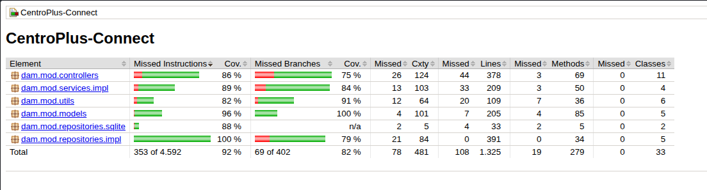

# 📘 CentroPlus Connect — Project Documentation

---

## 📑 Table of Contents

1. [Functional Documentation](#1-functional-documentation)
   - 1.1 [System Purpose](#11-system-purpose)
   - 1.2 [User Roles](#12-user-roles)
   - 1.3 [Main Features](#13-main-features)
2. [Use Cases](#2-use-cases)
   - 2.1 [Login](#21-login)
   - 2.2 [Logout](#22-logout)
   - 2.3 [Create Booking](#23-create-booking)
   - 2.4 [Cancel Booking](#24-cancel-booking)
   - 2.5 [Create Incident](#25-create-incident)
3. [System Architecture](#3-system-architecture)
   - 3.1 [Layers](#31-layers)
   - 3.2 [Architecture Flow](#32-architecture-flow)
4. [Security](#4-security)
   - 4.1 [Password Security](#41-password-security)
   - 4.2 [Remember-Me System](#42-remember-me-system)
   - 4.3 [Session Management](#43-session-management)
5. [Installation Guide](#5-installation-guide)
   - 5.1 [Requirements](#51-requirements)
   - 5.2 [Execution Steps](#52-execution-steps)
   - 5.3 [Database Configuration](#53-database-configuration)
6. [User Manual](#6-user-manual)
   - 6.1 [Login](#61-login)
   - 6.2 [Main Screen](#62-main-screen)
   - 6.3 [Profile](#63-profile)
7. [Test Plan](#7-test-plan)
   - 7.1 [Login Tests](#71-login-tests)
   - 7.2 [Booking Tests](#72-booking-tests)
   - 7.3 [Incident Tests](#73-incident-tests)
8. [Code Architecture](#8-code-architecture-java-packages)
9. [Login Flow](#9-login-flow)
10. [🧪 Test Coverage with JaCoCo](#10--test-coverage-with-jacoco)
11. [Summary](#11-summary)

---

# 1. Functional Documentation

## 1.1 System Purpose

CentroPlus Connect is a management system designed to handle users, activities, bookings, and incidents within an organised platform.

It allows users to:
- Register and authenticate
- Book activities
- Manage bookings
- Report incidents
- Maintain a persistent session (remember-me system)

---

## 1.2 User Roles

### Student (ALUMNO)
- View activities
- Create bookings
- Report incidents

### Member (SOCIO)
- Same permissions as a student
- Access to additional activities if available

### Both (AMBOS)
- Combination of student and member permissions

---

## 1.3 Main Features

- User authentication (login/logout)
- Persistent login (remember-me tokens)
- Activity management
- Booking system
- Incident system
- User profile management
- Session control

---

# 2. Use Cases

## 2.1 Login

**Actor:** User  
**Precondition:** The user exists in the database  

**Main flow:**
1. The user enters their ID and password
2. The system validates the credentials
3. If correct, the session is created
4. Optional: a remember-me token is generated

**Errors:**
- Invalid credentials
- Empty fields

---

## 2.2 Logout

**Actor:** Authenticated user  
**Precondition:** User is logged in  

**Flow:**
1. The system deletes the session
2. Removes the stored token (if it exists)
3. Redirects to the login screen

---

## 2.3 Create Booking

**Actor:** User  
**Precondition:** User is authenticated  

**Flow:**
1. The user selects an activity
2. The system checks availability
3. The booking is created
4. The activity slots are updated

---

## 2.4 Cancel Booking

**Actor:** User  
**Precondition:** The booking exists  

**Flow:**
1. The user selects the booking
2. The system marks it as cancelled
3. The activity slots are restored

---

## 2.5 Create Incident

**Actor:** User  
**Precondition:** User is authenticated  

**Flow:**
1. The user submits the incident form
2. The system saves it to the database
3. The status is set to OPEN

---

# 3. System Architecture

## 3.1 Layers

The system follows a layered architecture:

- Presentation layer → JavaFX Controllers
- Service layer → Business logic
- Repository layer → Database access (JDBC)
- Utilities layer → Session, tokens, navigation

---

## 3.2 Architecture Flow

```
Interface (JavaFX)
↓
Controller
↓
Service
↓
Repository
↓
SQLite Database
```

---

# 4. Security

## 4.1 Password Security
- Passwords are stored hashed (SHA-256 or equivalent)
- No passwords are stored in plain text

---

## 4.2 Remember-Me System
- Tokens are generated at login
- They are stored hashed
- They have an expiration date
- They are saved in the `remember_tokens` table

---

## 4.3 Session Management
- The active user is stored in memory (class `Session`)
- The user ID is stored in system preferences
- The session is deleted on logout

---

# 5. Installation Guide

## 5.1 Requirements
- Java 17 or higher
- Maven
- SQLite
- JavaFX

---

## 5.2 Execution Steps

1. Clone the repository
2. Open the project in an IDE
3. Build with Maven
4. Run the `Main` class

---

## 5.3 Database Configuration

File location:
```
mobile/src/main/resources/database/centroplus.db
```

No manual configuration required (SQLite included).

---

# 6. User Manual

## 6.1 Login
- Enter ID and password
- Optionally enable "Remember me"

## 6.2 Main Screen
- View available activities
- Access bookings
- Manage incidents

## 6.3 Profile
- View personal data
- Change password
- Log out

---

# 7. Test Plan

## 7.1 Login Tests
- Valid credentials → success
- Empty ID → error
- Empty password → error
- Wrong password → error
- Non-existent user → error

---

## 7.2 Booking Tests
- Create booking successfully
- Cancel booking successfully
- No available slots → error

---

## 7.3 Incident Tests
- Create incident successfully
- Empty fields → validation error

---

# 8. Code Architecture (Java Packages)

- `controllers` → interface logic
- `services` → business logic
- `repositories` → data access
- `models` → entities
- `utils` → utilities (Session, ScreenManager, TokenUtils)

---

# 9. Login Flow

```
User input
↓
Credential validation
↓
Repository query
↓
Password verification
↓
Session creation
↓
Optional token generation
↓
Redirect to main screen
```

---

# 10. 🧪 Test Coverage with JaCoCo

In **CentroPlus Connect** we have placed special emphasis on code quality through the implementation of an extensive test suite. To ensure the reliability of the system, we have used **JaCoCo (Java Code Coverage)** as our coverage analysis tool, which has allowed us to identify and cover the critical points of the application.

## What have we tested?

Unit and integration tests have been developed for the main modules of the project:

- **Controllers** (`dam.mod.controllers`) — input logic and request handling
- **Services** (`dam.mod.services.impl`) — application business rules
- **Utilities** (`dam.mod.utils`) — helper functions and utilities
- **Models** (`dam.mod.models`) — domain entities and objects
- **Repositories** (`dam.mod.repositories`) — data access layer (SQLite and implementations)

## Results

The analysis results show an **overall instruction coverage of 92%** and a **branch coverage of 82%**, reflecting a high level of confidence in the system's behaviour across different scenarios.

The JaCoCo report is shown below:



> *Report generated with JaCoCo 0.8.12 · Date: 2026-06-05*

---

# 11. Summary

CentroPlus Connect is a layered Java application that integrates:

- Authentication system
- Activity management
- Booking system
- Incident management
- Persistent login with tokens
- SQLite persistence