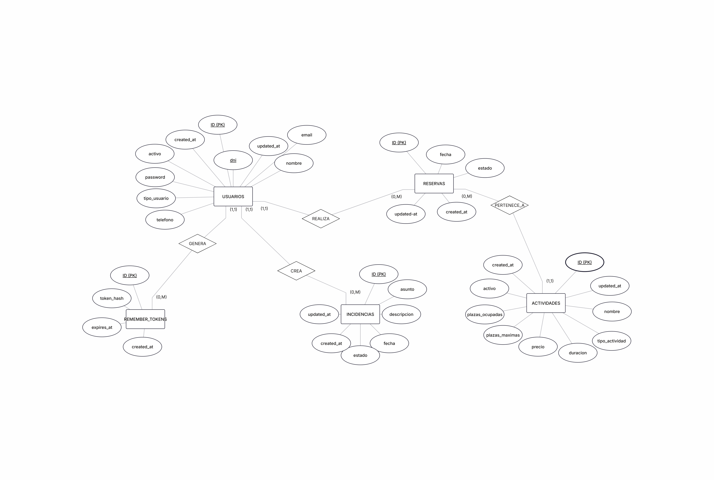
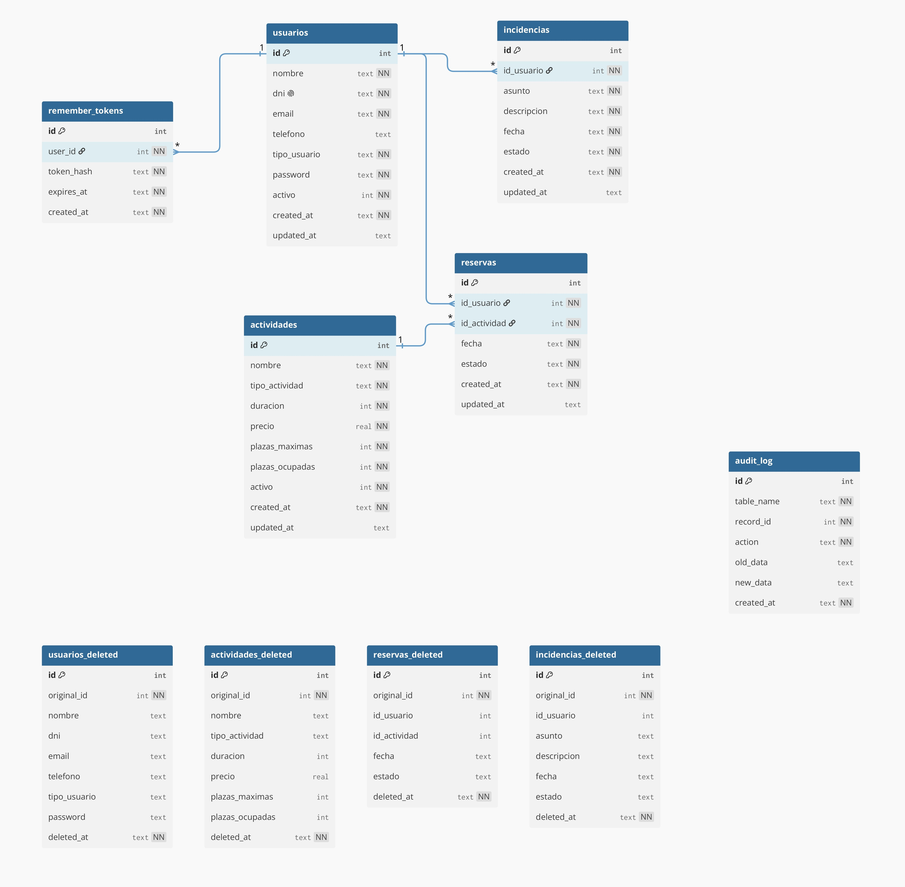

# Database — CentroPlus Connect

---

## 1. Description

The **CentroPlus Connect** database is developed using **SQLite3** and is designed to store all the information required by the system.

It is a relational database intended to be used by a Java application (JDBC), an API, and a user interface.

The model was designed following a complete analysis process: **Entity–Relationship model (ER), Relational Model (RM), and normalization up to 3NF**, ensuring data integrity and consistency.

---

## 2. Database modeling

### 2.1 Entity–Relationship Model (ER)

The ER model defines the main entities of the system and their relationships.

**Main entities:**
- Users
- Activities
- Reservations
- Incidents
- Remember_Tokens
- Audit_Log

**Main relationships:**
- A user can make multiple reservations (1:N)
- An activity can have multiple reservations (1:N)
- A user can generate multiple incidents (1:N)
- A user can have multiple authentication tokens (1:N)

This model represents the conceptual structure of the system before physical implementation.

---

### 2.2 Relational Model (RM)

The relational model transforms the ER model into physical tables.

**Main tables:**
- users
- activities
- reservations
- incidents
- remember_tokens
- audit_log

**Primary keys:**
- All tables use `id` as the primary key.

**Foreign keys:**
- reservations.user_id → users.id
- reservations.activity_id → activities.id
- incidents.user_id → users.id
- remember_tokens.user_id → users.id

This model ensures referential integrity between the different system entities.

---

### 2.3 Normalization

The database has been normalized up to **Third Normal Form (3NF)**.

#### 1NF (First Normal Form)
All attributes are atomic, with no repeating groups or multivalued fields.

#### 2NF (Second Normal Form)
All tables use simple primary keys, so there are no partial dependencies.

#### 3NF (Third Normal Form)
There are no transitive dependencies between non-key attributes. Each attribute depends only on the primary key of its table.

---

## 3. Table structure

### users
- id (PK)
- name
- dni (unique)
- email
- phone
- user_type
- password
- active
- created_at
- updated_at

---

### activities
- id (PK)
- name
- activity_type
- duration
- price
- max_spots
- occupied_spots
- active
- created_at
- updated_at

---

### reservations
- id (PK)
- user_id (FK)
- activity_id (FK)
- date
- status
- created_at
- updated_at

---

### incidents
- id (PK)
- user_id (FK)
- subject
- description
- date
- status
- created_at
- updated_at

---

### remember_tokens
- id (PK)
- user_id (FK)
- token_hash
- expires_at
- created_at

---

### audit_log
- id (PK)
- table_name
- record_id
- action
- old_data
- new_data
- created_at

---

## 4. Business rules validation

### user_type
- STUDENT
- MEMBER
- BOTH

### activity_type
- ACADEMIC
- SPORTS

### reservation status
- ACTIVE
- CANCELED
- COMPLETED

### incident status
- OPEN
- IN_PROGRESS
- CLOSED

---

## 5. Technology used

- SQLite3  
- JDBC (Java)

---

## 6. Database location

CentroPlus-Connect/mobile/src/main/resources/database/centroplus.db